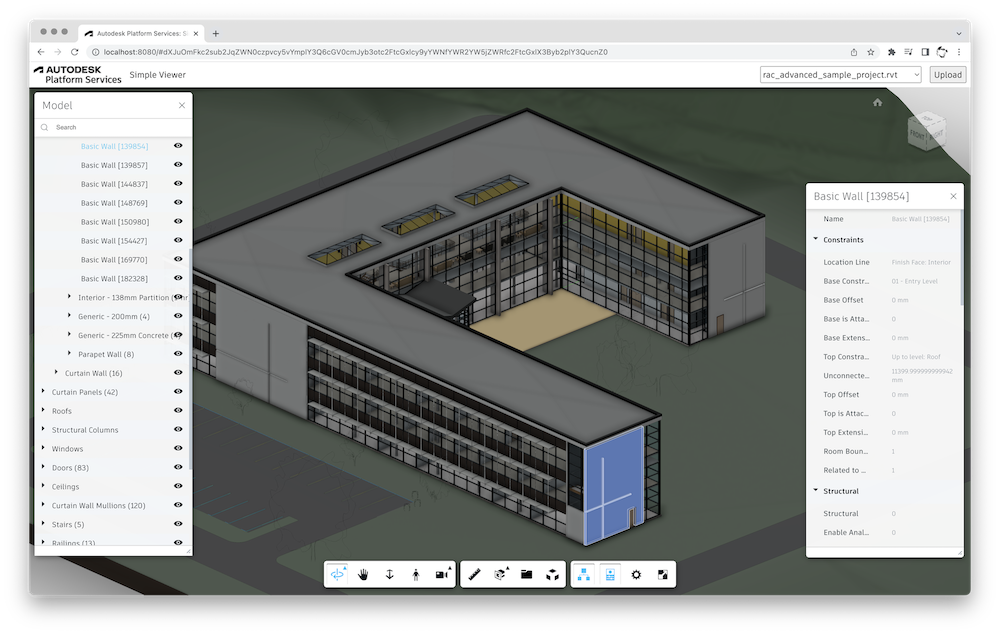

# Simple Viewer (Node.js)


[](https://nodejs.org)
[](https://www.npmjs.com/)
[](https://opensource.org/licenses/MIT)

[Autodesk Platform Services](https://aps.autodesk.com) application built by following
the [Simple Viewer](https://tutorials.autodesk.io/tutorials/simple-viewer/) tutorial
from https://tutorials.autodesk.io.



## Development

### Prerequisites

- [APS credentials](https://forge.autodesk.com/en/docs/oauth/v2/tutorials/create-app)
- [Node.js](https://nodejs.org) (Long Term Support version is recommended)
- Command-line terminal such as [PowerShell](https://learn.microsoft.com/en-us/powershell/scripting/overview)
or [bash](https://en.wikipedia.org/wiki/Bash_(Unix_shell)) (should already be available on your system)

> We recommend using [Visual Studio Code](https://code.visualstudio.com) which, among other benefits,
> provides an [integrated terminal](https://code.visualstudio.com/docs/terminal/basics) as well.

### Setup & Run

- Clone this repository: `git clone https://github.com/autodesk-platform-services/aps-simple-viewer-nodejs`
- Go to the project folder: `cd aps-simple-viewer-nodejs`
- Install Node.js dependencies: `npm install`
- Open the project folder in a code editor of your choice
- Create a _.env_ file in the project folder, and populate it with the snippet below,
replacing `<client-id>` and `<client-secret>` with your APS Client ID and Client Secret:

```bash
APS_CLIENT_ID="<client-id>"
APS_CLIENT_SECRET="<client-secret>"
```

- Run the application, either from your code editor, or by running `npm start` in terminal
- Open http://localhost:8080

> When using [Visual Studio Code](https://code.visualstudio.com), you can run & debug
> the application by pressing `F5`.

## Troubleshooting

Please contact us via https://forge.autodesk.com/en/support/get-help.

## License

This sample is licensed under the terms of the [MIT License](http://opensource.org/licenses/MIT).
Please see the [LICENSE](LICENSE) file for more details.
